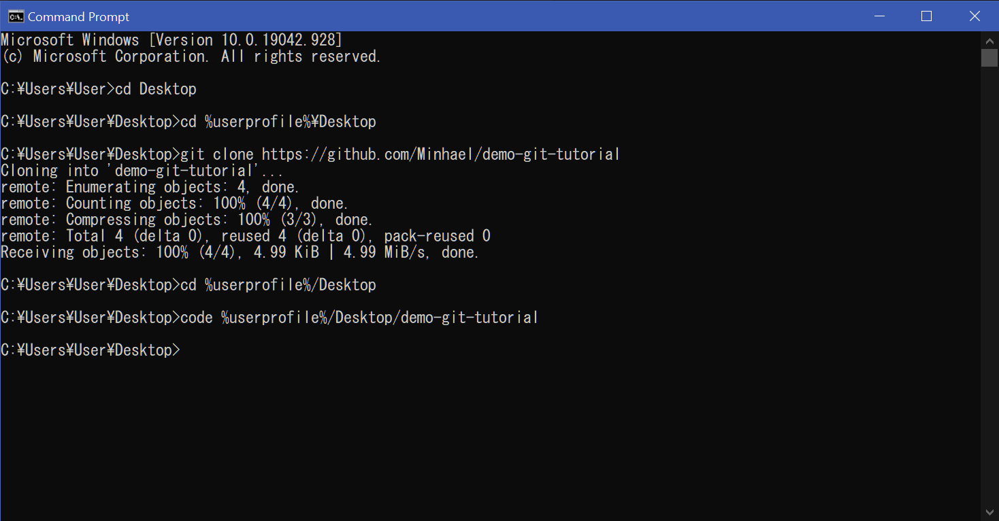
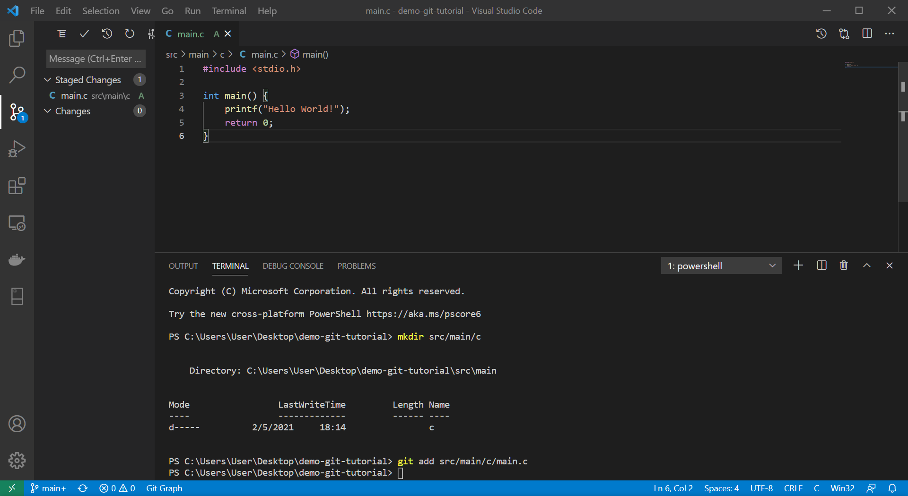
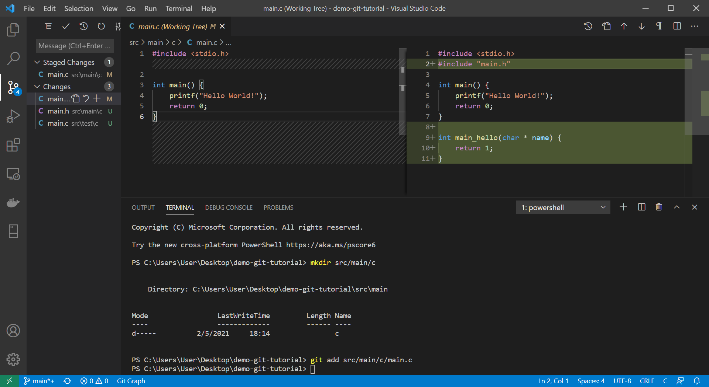
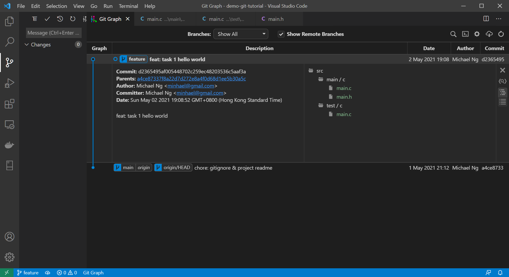
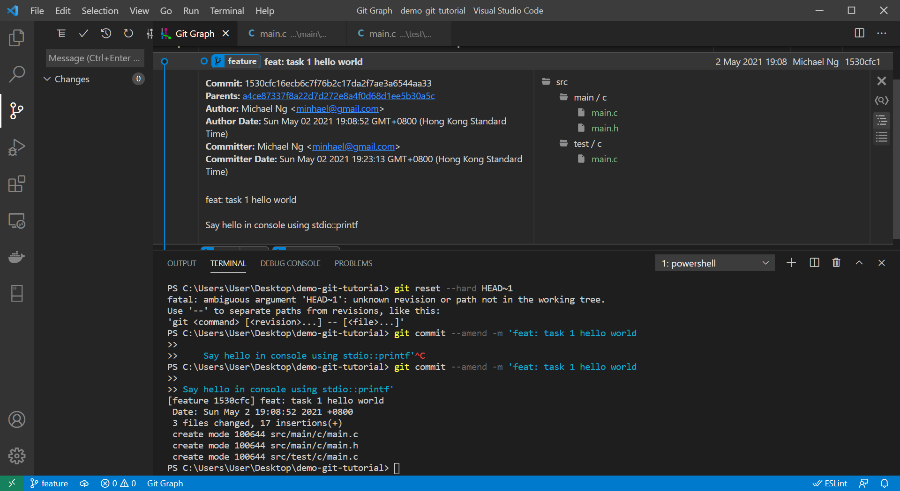
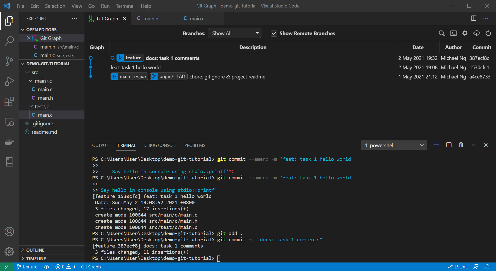
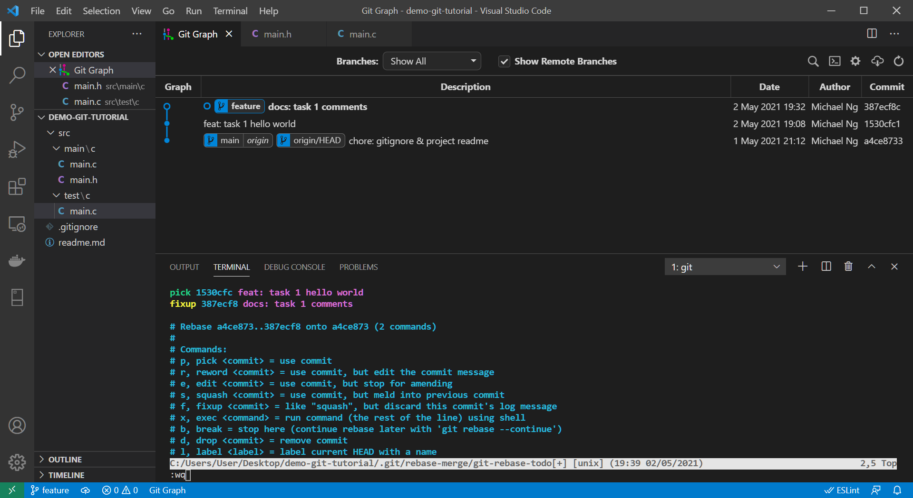
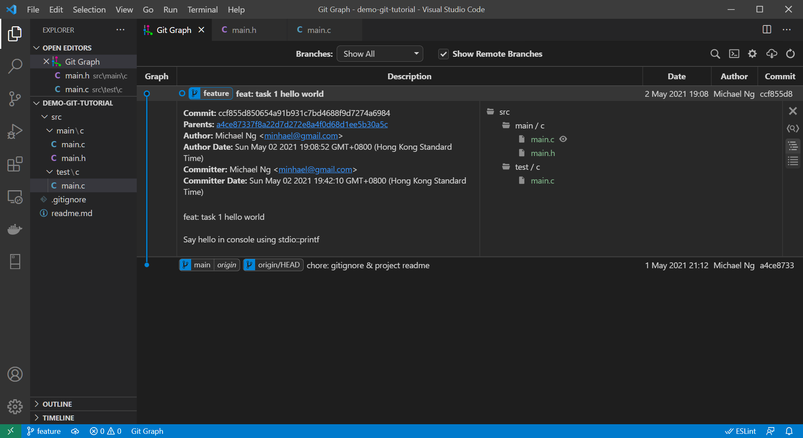
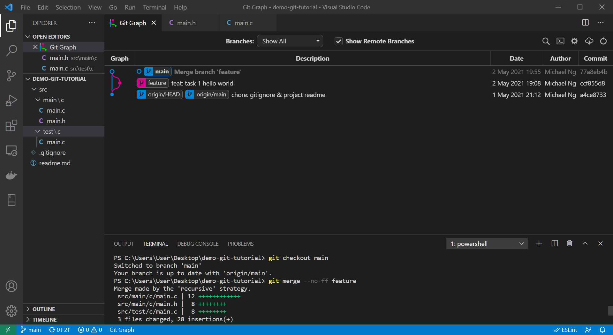
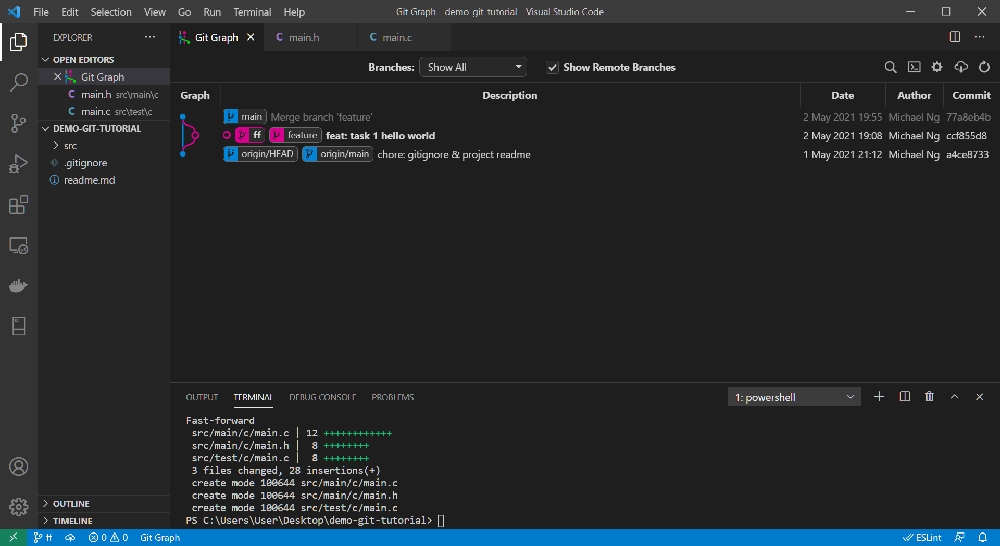

# commit-changes

This page goes through the workflow to commit changes to the repository.

# Objective

This tutorial will finish a hello world program written in [C](https://en.wikipedia.org/wiki/C_(programming_language)).

After finishing this tutorial, you will be able to 

* Clone remote repository
* Create feature branch
* Stage changes
* Commit changes
* Amend last commit
* Rewrite commit history
* Merge changes

# Clone Remote Repository

1. Open Command Prompt.

1. Change directory to the parent directory.
    ```bash
    cd %userprofile%/Desktop
    ```

1. Clone this repository from Github.
    ```bash
    https://github.com/Minhael/demo-git-tutorial
    ```

1. Start VSCode with project directory.
    ```bash
    code %userprofile%/Desktop/demo-git-tutorial
    ```
    <details>
    <summary><b>Click to view screenshot.</b></summary>

    
    </details>

1. Check the word `main` is displayed at the bottom left corner of VSCode window.

# Create feature branch

1. (Optional) Press `Ctrl + Shift + G` to open **Source Control** sidebar for visualising Git changes.

1. Press Ctrl + ` to open **Command Prompt**.

1. Create `feature` branch from `main` branch.
    ```bash
    git checkout -b feature main
    ```
    > Local `main` branch normally correlate to remote repository `main` branch, which contains accepted changes **ONLY**.

1. (Optional) Checkout `feature` branch.
    ```bash
    git checkout feature
    ```
    > Normally, Git switch to `feature` during create automatically.

# Stage changes

1. Create directory for source codes.
    ```bash
    mkdir src/main/c
    ```

1. In VSCode Explorer, create `main.c` under `/src/main/c`.
    ```c
    #include <stdio.h>

    int main() {
        printf("Hello World!");
        return 0;
    }
    ```

1. Stage `main.c`.
    ```bash
    git add src/main/c/main.c
    ```
    <details>
    <summary><b>Click to view screenshot.</b></summary>

    
    </details>

# Commit Changes

1. Create directory for tests.
    ```bash
    mkdir src/test/c
    ```

1. Create `main.h` under `src/main/c`.
    ```c
    int main_hello(char *name);
    ```

1. Modify and move `main.c` to `src/main/c`.
    ```c
    #include <stdio.h>
    #include "main.h"

    int main() {
        printf("Hello World!");
        return 0;
    }

    int main_hello(char * name) {
        return 1;
    }
    ```

1. Create `main.c` under `src/test/c`.
    ```c
    #include "../../main/c/main.h"

    int test_main_hello() {
        return 1;
    }
    ```

1. (Optional) View the changes of `main.c` between staged file and _working copy_ by clicking `main.c` under Changes in Source Control sidebar.
    <details>
    <summary><b>Click to view screenshot.</b></summary>

    
    </details>

1. Stage all changes.
    ```bash
    git add .
    ```
    > You can use `.gitignore` to [exclude](../git-ignore/readme.md) files that should not be commited.

1. Commit changes.
    ```bash
    git commit -m "feat: task 1 hello world"
    ```
    <details>
    <summary><b>Click to view screenshot.</b></summary>

    
    </details>

# Amend Last Commit

> This section only apply to local commits that is not pushed to remote repository.

1. Complete hello world implementation in `src/main/c/main.c` and `src/test/c/main.c`.
    ```c
    #include <stdio.h>
    #include "main.h"

    int main() {
        return main_hello("World");
    }

    int main_hello(char * name) {
        printf("Hello %s!\n", name);
        return 0;
    }
    ```
    ```c
    #include "../../main/c/main.h"

    int test_main_hello() {
        return main_hello("Unit Test");
    }
    ```

1. Stage changes.
    ```bash
    git add .
    ```

1. Amend the previous commit.
    ```bash
    git commit --amend -m 'feat: task 1 hello world

    Say hello in console using stdio::printf'
    ```
    <details>
    <summary><b>Click to view screenshot.</b></summary>

    
    </details>

# Rewrite Commit History

> This section should be applied to local commits that is not pushed to remote repository.

1. Write comments.
    ```c
    //  src/main/c/main.h

    /**
     * Main functions for user interactions
    * */

    /**
    * Say hello to user.
    * */
    int main_hello(char *name);
    ```
    ```c
    //  src/main/c/main.c

    #include <stdio.h>
    #include "main.h"

    //  Program entry point
    int main() {
        return main_hello("World");
    }

    int main_hello(char * name) {
        printf("Hello %s!\n", name);
        return 0;
    }
    ```
    ```c
    //  src/test/c/main.c

    #include "../../main/c/main.h"

    // TODO Should print a line "Hello Unit Test!"
    int test_main_hello() {
        return main_hello("Unit Test");
    }
    ```

2. Commit the comments.
    ```bash
    git add .
    git commit -m "docs: task 1 comments"
    ```
    <details>
    <summary><b>Click to view screenshot.</b></summary>

    
    </details>

3. Rewrite all the commits onto `main` branch using **rebase**.
    ```bash
    git rebase --interactive main
    # same as "git rebase -i main"
    ```
    > Rebase means writing the changes in each commit one by one onto the selected branch as if started working from that commit.

4. Edit and save the "rebase file" to _Pick_ the first commit and _Fixup_ the second commit.
    ```text
    pick 1530cfc feat: task 1 hello world
    fixup 387ecf8 docs: task 1 comments
    ```
    <details>
    <summary><b>Click to view screenshot.</b></summary>

    
    </details>
    
    > Read the comments in the file to know about other options.

5. (Optional) Open Git Graph and find all your changes in the newly created commit.
    <details>
    <summary><b>Click to view screenshot.</b></summary>

    
    </details>
    
    >Please note that the **commit hash** is changed to indicate it is a new commit.

# Merge Changes

1. Checkout `main` branch.
    ```bash
    git checkout main
    ```
    > **Merge** means pulling changes from another branch into this branch.

1. Merge `feature` into `main`.
    ```bash
    # --no-ff disable fast forwarding
    git merge --no-ff feature
    ```
    <details>
    <summary><b>Click to view screenshot.</b></summary>

    
    </details>

# Appendix - Fast Forward 

Merge again with fast forward using below commands to see the differences.
```bash
git checkout -b ff a4ce8733
git merge feature
```

Now `ff` branch just move to `HEAD` of feature without creating new commit because there are no conflicts between the 2 branches.
<details>
<summary><b>Click to view screenshot.</b></summary>


</details>

# Appendix - Linear History
Generally, you can combine fast-forward merge with rebase to maintain [_linear history_](https://dev.to/bladesensei/avoid-messy-git-history-3g26). 

See [SO post](https://stackoverflow.com/questions/20348629/what-are-advantages-of-keeping-linear-history-in-git) for pros & cons discussions.