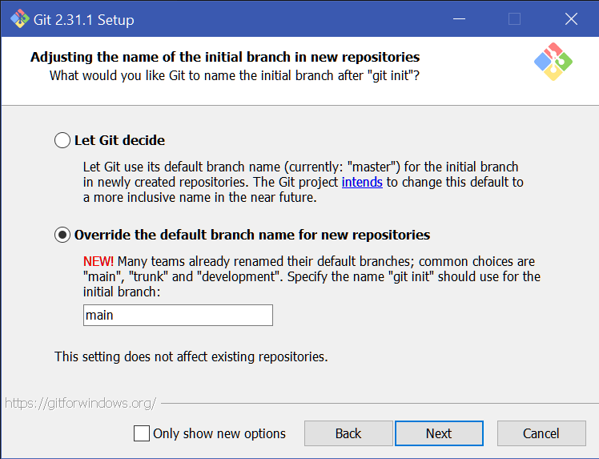
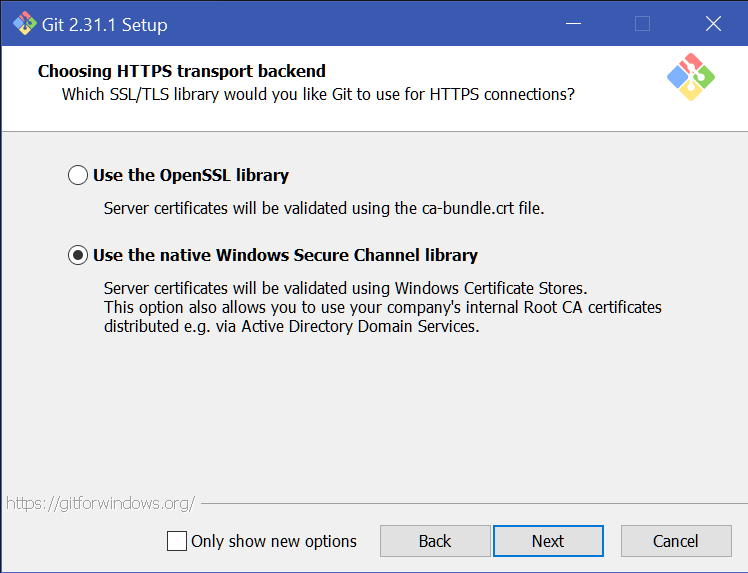
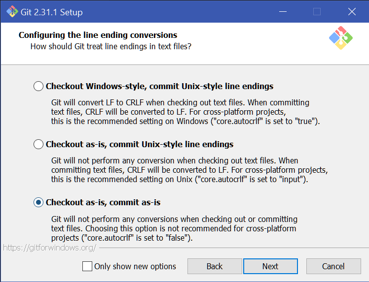

# Git Installation

Install Git executables from [official website](https://git-scm.com/downloads).

## Git for Windows

1. Configure default branch name.
    <details>
        <summary><b>Click to view screenshots</b></summary>
        
        
    </details>

1. Use Windows credentials for Git connections.
    <details>
        <summary><b>Click to view screenshot.</b></summary>

        
    </details>

    > You may import your ssh key into Windows to use [SSH for Git](https://docs.github.com/en/github/authenticating-to-github/connecting-to-github-with-ssh).

1. Configure commit style. Choose the one decided with your team.
    <details>
        <summary><b>Click to view screenshot.</b></summary>

        
    </details>

1. Confirm your installed Git version.
    ```bash
    git --version
    ```

# Git Configurations

1. Configure your name & email.
    ```bash
    git config --global user.name "Michael Ng"
    git config --global user-email "minhael@gmail.com"
    ```
1. Configure default Git editor. Choose the one you know best.
    ```bash
    # Notepad++
    git config --global core.editor "'C:/Program Files/Notepad++/notepad++.exe' -multiInst -notabbar -nosession -noPlugin"
    ```
    ```bash
    # Vim
    git config --global core.editor vi
    ```
    ```bash
    # Emacs
    git config --global core.editor emacs
    ```

## Git for Unix/Linux

1. Configure default branch name.
    ```bash
    git config --global init.defaultBranch main
    ```

# VSCode Extensions

1. Install [Git Graph](https://marketplace.visualstudio.com/items?itemName=mhutchie.git-graph).
1. (Optional) Install [.gitignore Generator](https://marketplace.visualstudio.com/items?itemName=piotrpalarz.vscode-gitignore-generator).
1. (Optional) Install [Git History](https://marketplace.visualstudio.com/items?itemName=donjayamanne.githistory).

# References

* [Getting Started - First-Time Git Setup](https://git-scm.com/book/en/v2/Getting-Started-First-Time-Git-Setup)