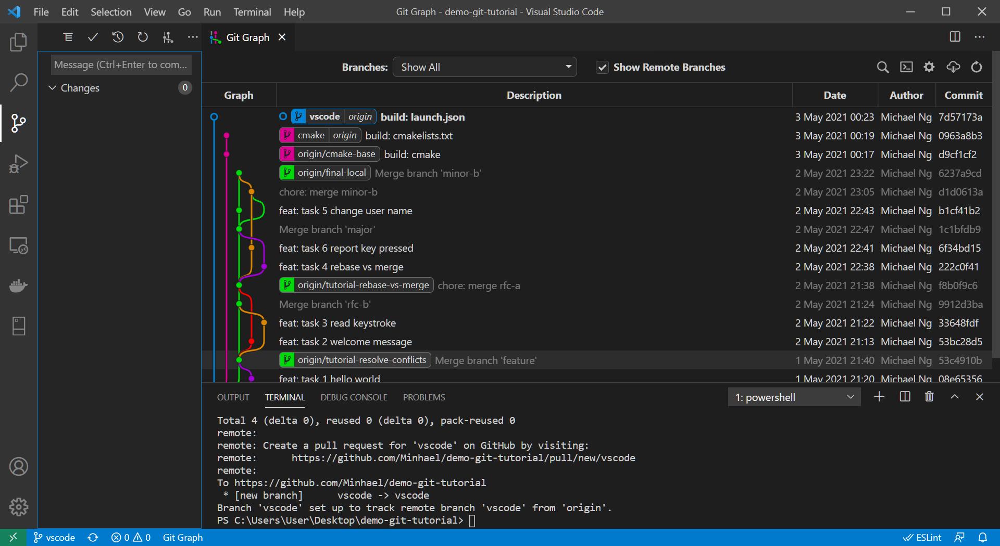
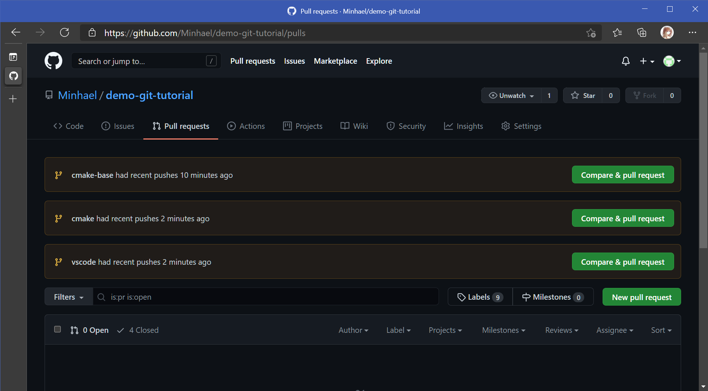
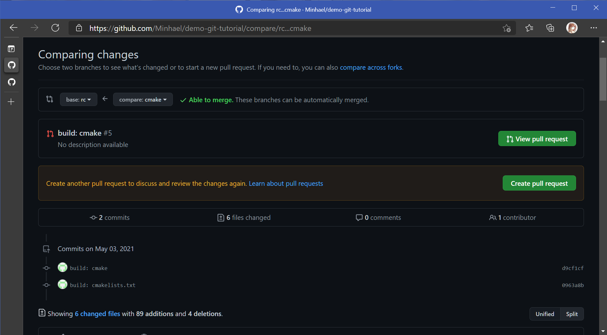
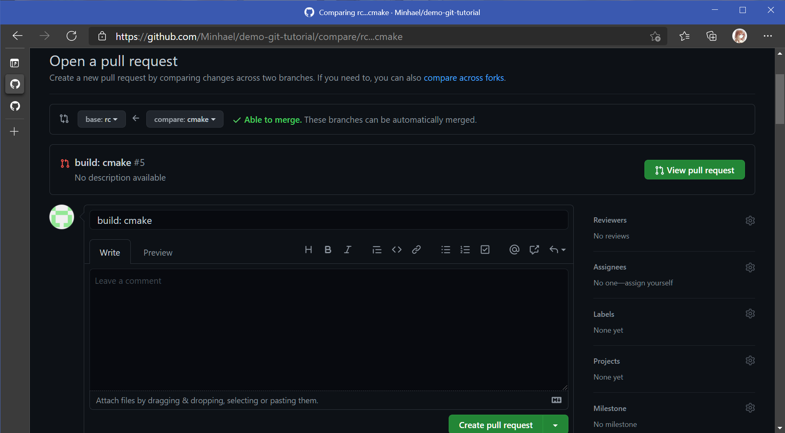
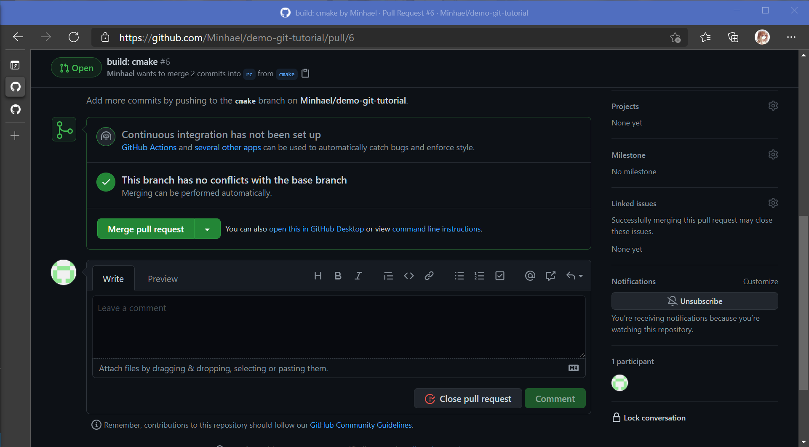
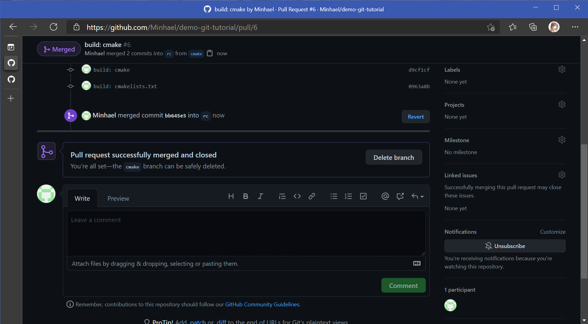
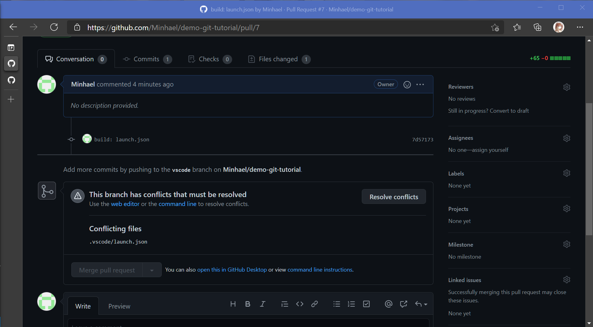
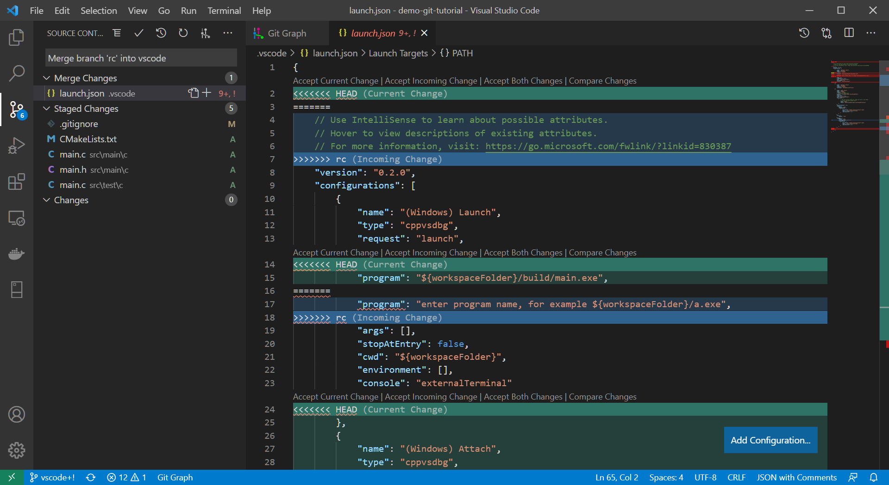

# pull-request

This page goes through the workflow to work with remote repository.

# Objective

This tutorial will create 2 feature branches to introduce 2 build systems. They will be pushed and merged into remote branch via **Pull Request**. Changes on remote branch will be pulled also to update local branches. After finishing this tutorial, you will able to 

* Push local branch to remote repository
* Open Pull Request
* Accept Pull Request and merge changes into remote branch
* Fetch remote branch updates
* Pull/Sync updates into local branch

# Attention

Normally, `main` branch is protected from merge. It is only the owner or the CI bots has the permission to make changes. For the purpose of this tutorial, a `rc` branch is created as if it is the `main` branch to accept Pull Request.

```bash
git checkout -b rc origin/main
git push --set-upstream origin rc
```

Also, for users who do not have permissions to push changes to this repository. You may read through the workflow and exercise in [Fork Repository](../fork-repository/readme.md) with Github.

# Create Feature Branches

1. Checkout `cmake` branch.
    ```bash
    git checkout -b cmake origin/cmake-base
    ```

1. Create `CMakeLists.txt` under project root directory and commit changes.
    ```cmake
    cmake_minimum_required(VERSION 3.0.0)
    project(demo-git-tutorial VERSION 0.1.0)

    include(CTest)
    enable_testing()

    add_executable(main src/main/c/main.c)

    set(CPACK_PROJECT_NAME ${PROJECT_NAME})
    set(CPACK_PROJECT_VERSION ${PROJECT_VERSION})
    include(CPack)
    ```
    ```bash
    git add .
    git commit -m "build: cmakelists.txt"
    ```

1. Checkout `vscode` branch.
    ```bash
    git checkout -b vscode origin/main
    ```

1. Create `.vscode/launch.json` and commit changes.
    ```json
    {
        "version": "0.2.0",
        "configurations": [
            {
                "name": "(Windows) Launch",
                "type": "cppvsdbg",
                "request": "launch",
                "program": "${workspaceFolder}/build/main.exe",
                "args": [],
                "stopAtEntry": false,
                "cwd": "${workspaceFolder}",
                "environment": [],
                "console": "externalTerminal"
            },
            {
                "name": "(Windows) Attach",
                "type": "cppvsdbg",
                "request": "attach",
                "processId": "${command:pickProcess}"
            },
            {
                "name": "(gdb) Launch",
                "type": "cppdbg",
                "request": "launch",
                // Resolved by CMake Tools:
                "program": "${command:cmake.launchTargetPath}",
                "args": [],
                "stopAtEntry": false,
                "cwd": "${workspaceFolder}",
                "environment": [
                    {
                        // add the directory where our target was built to the PATHs
                        // it gets resolved by CMake Tools:
                        "name": "PATH",
                        "value": "$PATH:${command:cmake.launchTargetDirectory}"
                    }
                ],
                "externalConsole": true,
                "linux": {
                    "MIMode": "gdb",
                    "setupCommands": [
                        {
                            "description": "Enable pretty-printing for gdb",
                            "text": "-enable-pretty-printing",
                            "ignoreFailures": true
                        }
                    ]
                },
                "osx": {
                    "MIMode": "lldb"
                },
                "windows": {
                    "MIMode": "gdb",
                    "miDebuggerPath": "gdb.exe",
                    "setupCommands": [
                        {
                            "description": "Enable pretty-printing for gdb",
                            "text": "-enable-pretty-printing",
                            "ignoreFailures": true
                        }
                    ]
                },
            }
        ]
    }
    ```
    ```bash
    git add .
    git commit -m "build: launch.json"
    ```

# Open Pull Requests

1. Push changes to `origin` remote repository.
    ```bash
    git checkout cmake
    git push --set-upstream origin cmake
    git checkout vscode
    git push --set-upstream origin vscode
    ```
    <details>
    <summary><b>Click to view screenshot.</b></summary>

    
    </details>

1. Browse Pull Request in Github project.
    

1. Create Pull Request merging `cmake` into `rc`.
    

1. Check all your changes and write the Pull Request comments.
    
    >Each project has their own format to describe the reason and impact of the PR. Project owner should define the policy for all developers.

1. Repeat the steps to open Pull Request merging `vscode` into `rc` .

# Accept Pull Requests

1. Browse the Pull Request for merging `cmake` into `rc`.

1. Click _Merge pull request_ to accept the PR and merge the changes from `cmake` into `rc`.
    
    
    >Please note that the platform also allow **Squash** and **Rebase** before merge.

1. Browse the Pull Request for mergin `vscode` into `rc`.
    
    > `cmake` branch changed `launch.json` so `vscode` conflicts with `rc` after `cmake` was merged into `rc`.

1. In VSCode, **Fetch** the status of the `origin` remote repository.
    ```bash
    git fetch
    ```

1. Update `rc` and merge into `vscode`.
    ```bash
    git checkout rc
    git pull
    git checkout vscode
    git merge rc
    ```

1. _Accept Current Change_ to resolve the conflicts.
    

1. Commit and push changes.
    ```bash
    git add .
    git commit -m "chore: merge rc"
    git push
    ```

1. Browse the Pull Request for mergin `vscode` into `rc` again.

1. Click _Merge pull request_ to accept the PR and merge the changes from `vscode` into `rc`.

1. Delete merged remote branch.
    ```bash
    git push origin --delete cmake
    git push origin --delete vscode

    # Clean up
    git push origin --delete rc
    ```

# Appendix - Upstream Branch

Upstream branch is the branch the local branch pulling changes from. Some IDE helps pulling the changes for upstream branch every time you open it.

You may change the branch to track another remote branch by:
```bash
git branch -u origin/main
```