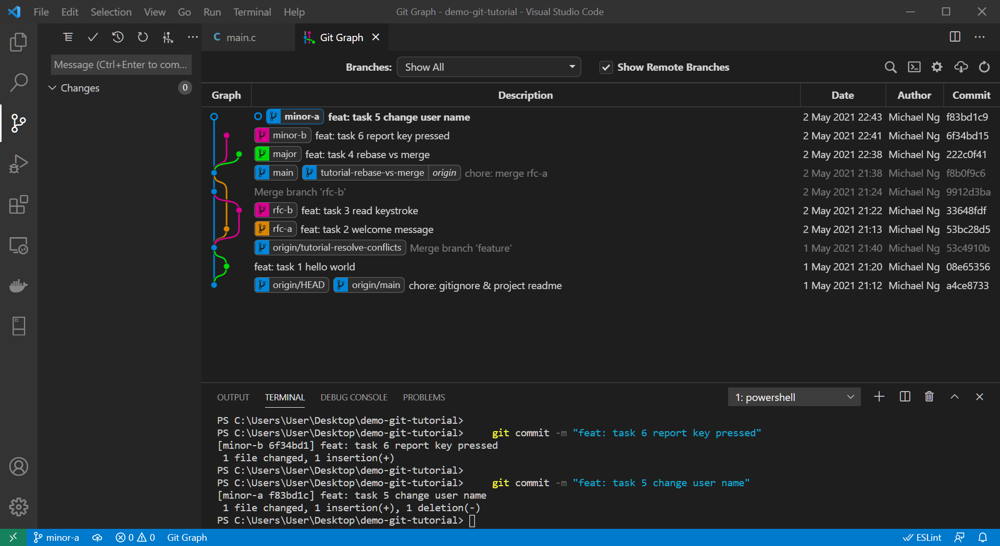

# rebase-vs-merge

This page goes through the workflow to update the working copy with the latest changes from the others.

# Initiative

Both **rebase** and **merge** can include changes from the other branches. However, rebased commits are regarded as completely new commit and different to the others sharing the same commit history.

Developers should be careful about the differences. 
* Use **rebase** to keep the commit history clean and tidy;
* Use **merge** to update changes without breaking the others work.

# Objective

This tutorial will develop 3 different branches. 1 will be merged first. 2 will be merged later after updating the latest changes. After finishing this tutorial, you will able to 

* Rebase changes onto latest source code copy.
* Merge latest changes from other branch.

# Create feature branches

1. (Optional) Reset `main` to `tutorial-rebase-vs-merge` branch. Skip if you just finish [resolve-conflicts](../resolve-conflicts/readme.md)
    ```bash
    git checkout main
    git reset --hard origin/tutorial-rebase-vs-merge
    ```

1. Create `major` branch.
    ```bash
    git checkout -b major main
    ```

1. Commit changes.
    ```c
    //  src/main/c/main.h

    /**
     * Main functions for user interactions
    * */

    /**
    * Say hello to user.
    * */
    int main_hello(char *name);

    /**
    * Read keystroke
    * */
    int main_read_keystroke(char *c);
    ```
    ```c
    //  src/main/c/main.c

    #include <stdio.h>
    #include "main.h"

    //  Program entry point
    int main() {
        int rt = 0;
        
        rt = main_hello("my friend");
        if (rt > 0)
            return rt;

        char c = "\0";
        rt = main_read_keystroke(&c);
        if (rt > 0)
            return rt;

        return 0;
    }

    int main_hello(char * name) {
        printf("Greetings %s! Enjoy your day here.\n", name);
        return 0;
    }

    int main_read_keystroke(char *c) {
        scanf("%c", &c);
        return 0;
    }
    ```
    ```bash
    git add .
    git commit -m "feat: task 4 rebase vs merge"
    ```

1. Create `minor-a` branch.
    ```bash
    git checkout -b minor-a main
    ```

1. Commit changes
    ```c
    //  src/main/c/main.c

    #include <stdio.h>
    #include "main.h"

    //  Program entry point
    int main() {
        int rt = 0;
        
        rt = main_hello("valued customer");
        if (rt > 0)
            return rt;

        char c = "\0";
        rt = main_read_keystroke(&c);
        if (rt > 0)
            return rt;

        return 0;
    }

    int main_hello(char * name) {
        printf("Greetings %s! Enjoy your day here.\n", name);
        return 0;
    }

    int main_read_keystroke(char *c) {
        scanf("%c", &c);
        return 0;
    }
    ```
    ```bash
    git add .
    git commit -m "feat: task 5 change user name"
    ```

1. Create `minor-b` branch.
    ```bash
    git checkout -b minor-b main
    ```

1. Commit changes.
    ```c
    //  src/main/c/main.c

    #include <stdio.h>
    #include "main.h"

    //  Program entry point
    int main() {
        int rt = 0;
        
        rt = main_hello("User");
        if (rt > 0)
            return rt;

        char c = "\0";
        scanf("%c", &c);
        printf("You pressed %c\n", c);

        return 0;
    }

    int main_hello(char * name) {
        printf("Greetings %s! Enjoy your day here.\n", name);
        return 0;
    }
    ```
    ```bash
    git add .
    git commit -m "feat: task 6 report key pressed"
    ```

<details>
<summary><b>Click to view screenshot.</b></summary>


</details>

# Merge Major Changes

1. Merge `major` into `main`.
    ```bash
    git checkout main
    git merge --no-ff major
    ```
    <details>
    <summary><b>Click to view screenshot.</b></summary>

    
    </details>

# Rebase to Update Changes

1. Rebase `minor-a` onto `main`.
    ```bash
    git checkout minor-a
    git rebase main
    ```

1. _Accept Incoming Change_ to resolve conflicts.
    ```c
    //  src/main/c/main.c

    #include <stdio.h>
    #include "main.h"

    //  Program entry point
    int main() {
        int rt = 0;
        
        rt = main_hello("valued customer");
        if (rt > 0)
            return rt;

        char c = "\0";
        rt = main_read_keystroke(&c);
        if (rt > 0)
            return rt;

        return 0;
    }

    int main_hello(char * name) {
        printf("Greetings %s! Enjoy your day here.\n", name);
        return 0;
    }

    int main_read_keystroke(char *c) {
        scanf("%c", &c);
        return 0;
    }
    ```
    <details>
    <summary><b>Click to view screenshot.</b></summary>

    
    </details>

1. Stage changes, continue rebase and save the new commit message.
    ```bash
    git add .
    git rebase --continue
    ```
    <details>
    <summary><b>Click to view screenshot.</b></summary>

    
    </details>

# Merge to Update Changes

1. Merge `main` into `minor-b`.
    ```bash
    git checkout minor-b
    git merge main
    ```
    <details>
    <summary><b>Click to view screenshot.</b></summary>

    
    </details>

1. Resolve conflicts manually.
    ```c
    //  src/main/c/main.c

    #include <stdio.h>
    #include "main.h"

    //  Program entry point
    int main() {
        int rt = 0;
        
        rt = main_hello("my friend");
        if (rt > 0)
            return rt;

        char c = "\0";
        rt = main_read_keystroke(&c);
        if (rt > 0)
            return rt;
        printf("You pressed %c\n", c);

        return 0;
    }

    int main_hello(char * name) {
        printf("Greetings %s! Enjoy your day here.\n", name);
        return 0;
    }

    int main_read_keystroke(char *c) {
        scanf("%c", &c);
        return 0;
    }
    ```
    > Both branches changed the same block and Git is not smart enough to simple insert the line from `minor-b` into `main`.

1. Stage and commit changes.
    ```bash
    git add .
    git commit -m "chore: merge minor-b"
    ```

# Finish Up

1. Merge `minor-a` into `main` with Fast Forwarding.
    ```bash
    git checkout main
    git merge minor-a
    ```

1. Merge `minor-b` into `main`.
    ```bash
    git merge minor-b
    ```

# Comparison


`minor-a` changes were rewritten as if the development was started after `major` was merged. Previous commits are deleted. Changes are moved to the new commit. Combining with _Fast Forwarding_, merging `minor-a` into `main` create _linear history_. However, colleagues sharing the same branch are not able to merge with yours again, since it is already a different `minor-a` with different history.

`minor-b` changes were merged and the commit history were preserved. However, the graph becomes complex and looks messy.

<details>
<summary><b>Click to view screenshot.</b></summary>


</details>

Mixing both styles also create confusions in reading the graph. Project owner should define the policy clearly to all co-developers.