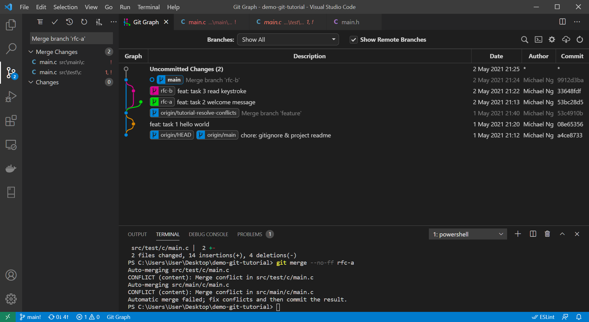

# resolve-conflicts

This page goes through the workflow to resolve conflicts when merging branches.

# Objective

This tutorial will parallely develop 2 feature branches and merge into `main` branch. After finishing this tutorial, you will able to 

* Resolve conflicts during merge or rebase

# Create feature branches

1. (Optional) Reset `main` to `tutorial-resolve-conflicts` branch. Skip if you just finish [commit-changes](../commit-changes/readme.md)
    ```bash
    git checkout main
    git reset --hard origin/tutorial-resolve-conflicts
    ```
    > **Hard Reset** will erase all your commits and changes. Ask someone unless you know what you are doing.

1. Create `rfc-a` branch.
    ```bash
    git checkout -b rfc-a main
    ```

1. Modify `src/main/c/main.c` and `src/test/c/main.c`.
    ```c
    #include <stdio.h>
    #include "main.h"

    //  Program entry point
    int main() {
        return main_hello("World");
    }

    int main_hello(char * name) {
        printf("Greetings %s! Enjoy your day here.\n", name);
        return 0;
    }
    ```
    ```c
    #include "../../main/c/main.h"

    // TODO Should print a line "Greetings Unit Test! Enjoy your day here."
    int test_main_hello() {
        return main_hello("Unit Test");
    }
    ```

1. Commit changes
    ```bash
    git add .
    git commit -m "feat: task 2 welcome message"
    ```

1. Create `rfc-b` branch.
    ```bash
    git checkout -b rfc-b main
    ```

1. Modify `src/main/c/main.c` and `src/test/c/main.c`.
    ```bash
    #include <stdio.h>
    #include "main.h"

    //  Program entry point
    int main() {
        int rt = 0;
        
        rt = main_hello("User");
        if (rt > 0)
            return rt;

        char c = "\0";
        scanf("%c", &c);

        return 0;
    }

    int main_hello(char * name) {
        printf("Welcome %s! Have a good day!\n", name);
        return 0;
    }
    ```
    ```bash
    #include "../../main/c/main.h"

    // TODO Should print a line "Welcome Unit Test! Have a good day."
    int test_main_hello() {
        return main_hello("Unit Test");
    }
    ```

1. Commit changes
    ```bash
    git add .
    git commit -m "feat: task 3 read keystroke"
    ```

<details>
<summary><b>Click to view screenshot.</b></summary>


</details>

# Resolve conflicts

1. Merge `rfc-b` into `main`.
    ```bash
    git checkout main
    git merge --no-ff rfc-b
    ```

1. Merge `rfc-a` into `main`.
    ```bash
    git merge --no-ff rfc-a
    ```

1. Press `Ctrl + Shift + G` to open **Source Control** sidebar and click `src/main/c/main.c` under _Merge Changes_.
    <details>
    <summary><b>Click to view screenshot.</b></summary>

    
    </details>

    > Examine the file and see how Git merge the lines without conflicts.

1. Click _Accept Incoming Change_ in VSCode and save the file.
    <details>
    <summary><b>Click to view screenshot.</b></summary>

    
    </details>

1. Click `src/test/c/main.c` under _Merge Changes_ and accept all incoming changes again.
    <details>
    <summary><b>Click to view screenshot.</b></summary>

    
    </details>

    > You may manually edit the file without using the function provided by VSCode.

1. Stage and commit the changes.
    ```bash
    git add .
    git commit -m "chore: merge rfc-a"
    ```
    <details>
    <summary><b>Click to view screenshot.</b></summary>

    
    </details>
    